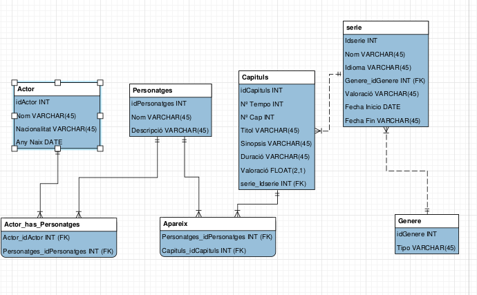

# Bienvenido a nuestro proyecto 

Este proyecto es de la asignatura de IAW( Implantación de Aplicaciones Wev) , dada por nuestro tutor Alfredo,en este proyecto los editores del material serán Jonathan  y Vicent. Este proyecto para explicaros es  una enciclopedia de series de anime donde los usuarios podrán ver información de dichas series y de sus personajes.

## Usuarios

|                                      Tipos de usuarios |Permisos                        |
|----------------|-------------------------------|
|Usuario simple|Podrá ver la pagina web pero sin poder añadir información            |
|Usuario Registrado  |Podrá añadir información al proyecto       |
|Administrador    |Tendrá el control  absoluto de la pagina podrá añadir borrar..etc|

## Diagrama de la pagina web

Aquí podremos ver como tendremos en un diseño nuestra pagina web
La pagina normal sera la que vea un usuario que no sea registrado
La pagina para usuarios registrados  podrán ver todo los mismo que un usuario normal
La pagina web podrá ver estadísticas de la web , y ademas de poder añadir y borrar informacion

## Vista previa

**[View Live Preview](https://blackrockdigital.github.io/startbootstrap-4-col-portfolio/)**

